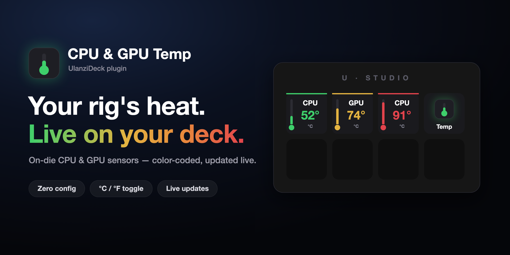
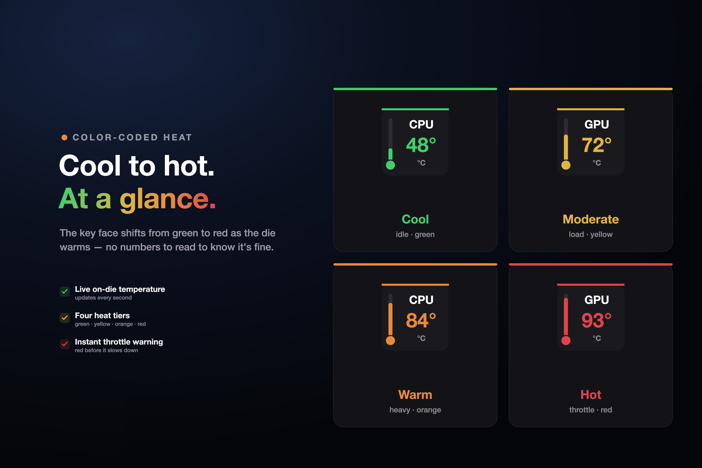
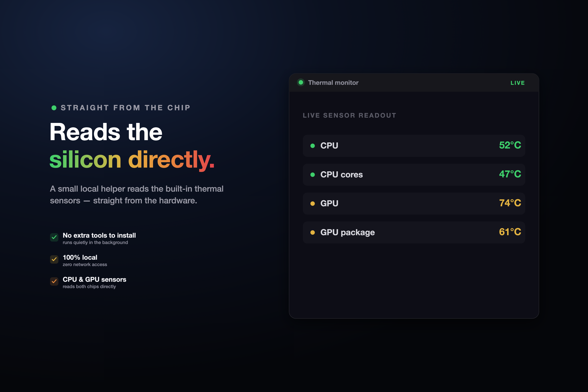

# GPU & CPU Temperature - Ulanzi Deck Plugin

**Your machine's temperature — live on two physical buttons.**

No Activity Monitor, no Task Manager, no HWiNFO window to keep open. Just glance at your deck.



[](https://ulanzicommunitystore.narlei.com)
[](LICENSE)
[]()
[]()
[]()

---

## Why this exists

You're rendering, compiling, or gaming, and the fan spins up — is that normal, or is the CPU about to throttle? Alt-tabbing to Activity Monitor or Task Manager breaks your flow, and most temperature apps either want a menu-bar slot or a background window.

This plugin puts both readings where your hands already are: two keys, always current, color-coded so you know it's fine without reading a number.

---

## Install

**Option 1 — Ulanzi Community Store** (recommended): search "GPU & CPU Temperature" in the store and add it.

**Option 2 — manual:** download the latest `.zip` from [Releases](https://github.com/narlei/ulanzideck-gpu-cpu-temperature/releases), unzip it into your Ulanzi Deck `Plugins` folder, and restart Ulanzi Studio.

> **Requirements:** [Ulanzi Studio](https://www.ulanzi.com/pages/download) 3.0.11+ · macOS 10.15+ or Windows 10+

Drag **CPU Temperature** and **GPU Temperature** onto any two keys. That's it — no API keys, no accounts, no configuration required to get a live reading.

---

## Cool to hot. At a glance.



The key face shifts from green to red as the die warms — no numbers to read to know it's fine.

| Tier | Range | What it means |
|---|---|---|
| 🟢 **Cool** | below 65 °C | idle or light load |
| 🟡 **Moderate** | 65–79 °C | normal load |
| 🟠 **Warm** | 80–89 °C | heavy load |
| 🔴 **Hot** | 90 °C+ | approaching throttle |

Both keys update on their own schedule (default **10 s**, configurable per key from **3 s** up to **30 s** in the button settings) and report the **hottest sensor on the die** — the same convention tools like HWiNFO and CleanMyMac use, not a softened average.

---

## Reads the silicon directly



A small native helper reads the built-in thermal sensors straight from the hardware — no extra tools to install, nothing running in your menu bar, **zero network access**.

- **macOS** — a tiny Swift binary talks to the same private IOKit sensor API used by tools like `macmon`. No `sudo`, no kernel extension, no admin prompt.
- **Windows** — a self-contained helper built on [LibreHardwareMonitorLib](https://github.com/LibreHardwareMonitor/LibreHardwareMonitor) (the engine behind HWiNFO).

> ⚠️ **Windows only:** reading full CPU package temperature requires the WinRing0 driver, which needs Administrator privileges. Right-click **Ulanzi Studio → Run as administrator** once. Without it, the CPU key falls back to showing **N/A** instead of a wrong number.

Click either key any time to toggle its display between **°C** and **°F** — the choice is saved per key.

---

## Privacy & security

- **No network access, period.** The plugin never makes an HTTP request. Every reading comes from a local process reading local hardware.
- **No telemetry.** Nothing about your machine, your temperatures, or your usage is collected or transmitted anywhere.
- **No elevated background service on macOS.** The native helper runs as your user, same as any other app.
- **Open source.** Every line — including the native helpers — is in this repo.

---

## How it works

Each poll spawns the platform helper, which prints one line per die sensor (`name\tcelsius`). The plugin then:

1. **Classifies** sensors into CPU/GPU. On Windows the helper already tags each line by hardware type; on macOS sensor names are opaque, so an ordered list of regex matchers is used per platform generation (verified empirically on Apple M4: `PMU tdie*` tracks the CPU cluster, `PMU2 tdie*` tracks the GPU cluster — CPU load raises the former ~7 °C while the latter stays flat).
2. **Reports the peak** — the hottest matched sensor, not an average, so the reading matches what other monitoring tools show.
3. **Renders** an SVG thermometer icon color-coded by the ranges above and pushes it to the key via `setBaseDataIcon`.

> The macOS helper is a universal (Apple Silicon + Intel) binary, ad-hoc signed, with automatic Gatekeeper-quarantine removal on first run — so it works immediately after a ZIP download, no manual "Allow anyway" click needed.

---

## Development

```bash
git clone https://github.com/narlei/ulanzideck-gpu-cpu-temperature
cd ulanzideck-gpu-cpu-temperature
make install   # compile both native helpers + sync to UlanziDeck + restart
```

| Command | What it does |
|---|---|
| `make helper` | Compile the macOS helper (universal arm64 + x86_64, ad-hoc signed) |
| `make helper-windows` | Cross-compile the Windows helper (self-contained win-x64, requires `dotnet`) |
| `make deps` | Install the plugin's runtime `node_modules` (`ws`) |
| `make package` | Build the distributable ZIP → `dist/` (both helpers included) |
| `make restart` | Restart Ulanzi Studio only |
| `make bump_patch` | Bump version (patch / minor / major) |

**Layout**

```
com.narlei.gpucputemperature.ulanziPlugin/   # the plugin bundle
├── plugin/              # app.js, sensors.js, renderer.js
├── property-inspector/  # unit + update-interval settings
├── helper/              # thermal.swift → universal macOS binary
├── helper-windows/      # Program.cs, UpdateVisitor.cs → thermal.exe
├── resources/           # icon.png, action-cpu.png, action-gpu.png (in-app assets)
└── en.json / pt_BR.json
resources/                # cover.png, banner1.png, banner2.png (store listing only)
store.json                 # Ulanzi Community Store metadata
```

---

MIT © [Narlei Moreira](https://github.com/narlei)
